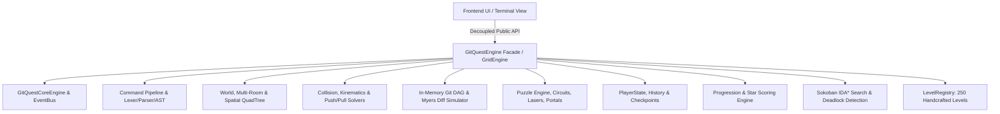

# GitQuest Game Engine Documentation

## 1. Subsystem Architecture Overview

GitQuest is powered by a high-performance, modular, in-memory game engine decoupled from any UI rendering framework. The engine coordinates spatial partitioning, physics, simulated Git DAG operations, circuit logic gates, optics, AI steering, and multi-stage objectives.



---

## 2. Game State & Player State Management

- **`PlayerState` (`js/engine/state/PlayerState.js`)**: Encapsulates player coordinates `(x, y)`, facing direction (`up`, `down`, `left`, `right`), lives, stamina, XP, and inventory items.
- **`GitRepoState`**: Represents the live simulated repository state, tracking the active branch, HEAD commit hash, index stage slots, and uncommitted status.
- **`HistoryManager` (`js/engine/state/HistoryManager.js`)**: Manages the undo/redo stack, serializing full spatial and repository snapshots on every move/push/pull action.
- **`CheckpointManager` (`js/engine/checkpoints/CheckpointManager.js`)**: Supports saving named checkpoints and restoring state upon hazard trigger or reset.

---

## 3. Movement & Directional Pull Mechanics

Movement and pulling are fundamentally distinct mechanics:

### Player Movement (`git left`, `git right`, `git up`, `git down`, or `w`, `a`, `s`, `d`)
- Moves the player 1 step in the specified direction.
- If the target cell contains a pushable object (box/crate), tests the space beyond the box. If unobstructed, advances both the box and player (`gitPush`).

### Directional Pull (`git pull left`, `git pull right`, `git pull up`, `git pull down`, or `git pull`)
- **Action**: Interacts with the adjacent object in the specified direction.
- **Mechanism**: Drags the target object into the player's current coordinate while the player steps 1 tile backward.
- **Obstruction Validation**: If the cell behind the player contains a wall, boundary, or hazard, the pull action is safely rejected with `obstructed_pull_path`.

---

## 4. Command Pipeline & Parser

Commands pass through lexical tokenization, AST parsing, middleware filters, and dynamic handler dispatch:

- **Tokens & Lexer (`js/engine/commands/CommandToken.js`)**: Tokenizes flags (`-m`, `-b`, `--hard`), quoted strings, arguments, and pipes.
- **AST Transformer (`js/engine/commands/CommandAstTransformer.js`)**: Supports command chaining (`git pull left && git commit`), macro expansion, and autocompletion.
- **Core Handlers**: `StatusHandler`, `PushHandler`, `PullHandler`, `CommitHandler`, `SwitchHandler`, `BranchHandler`, `MergeHandler`, `RebaseHandler`, `StashHandler`, `CherryPickHandler`, `DiffHandler`, `LogHandler`, `BisectHandler`.

---

## 5. Puzzle Systems & Interactive Mechanisms

1. **Boolean Logic Gates (`js/engine/puzzles/mechanisms/CircuitSimulator.js`)**: AND, OR, XOR, NOT, NAND, NOR logic gates and flip-flops connected to security pressure plates.
2. **Optics & Laser Relays (`js/engine/puzzles/mechanisms/LaserEmitterAndMirrorSystem.js`)**: 45-degree angle rotating mirrors, beam splitters, and photo receptors.
3. **Quantum Entanglement (`js/engine/puzzles/mechanisms/QuantumEntanglementSolver.js`)**: Entangled crate pairs with synchronized, mirrored, and inverted movement vectors.
4. **Conveyors & Teleportation Portals (`js/engine/puzzles/mechanisms/PortalNetwork.js`)**: Velocity boosters and paired spatial teleport loops.
5. **Tactical Steering & Sensory Perception (`js/engine/world/TacticalSteeringAI.js`)**: Enemy drone armadas with Line of Sight, FOV raycasting, acoustic sound diffraction, and kinematic steering behaviors.

---

## 6. Level System & Creating New Levels

The level system is scalable across 20 Worlds and 250 handcrafted levels.

### How to Add a New Level:
Create or register a level definition matching `LevelDefinition`:

```javascript
import { GlobalLevelRegistry } from './js/engine/levels/LevelRegistry.js';

GlobalLevelRegistry.registerCustomLevel({
  id: 'custom_01',
  name: 'Quantum Portal Citadel',
  world: 1,
  difficulty: 'MEDIUM',
  stars: 3,
  xpReward: 1000,
  description: 'Teleport the payload through the portal network to the review station.',
  objectives: ['Step on activation switch', 'Commit payload to (4, 4)'],
  hint: 'Use git pull left to position the box on the portal entrance.',
  gridSize: 8,
  player: { x: 1, y: 1 },
  box: { x: 2, y: 2 },
  goal: { x: 6, y: 6 },
  walls: [
    { x: 0, y: 0 }, { x: 7, y: 7 },
    { x: 3, y: 3 }, { x: 4, y: 3 }
  ],
  hazards: [{ x: 5, y: 2 }]
});
```

---

## 7. Frontend Integration Contract

The frontend connects to the engine through [`EngineFacade.js`](file:///c:/Users/HP/OneDrive/Desktop/githero/js/engine/api/EngineFacade.js) and [`CompatibilityAdapter.js`](file:///c:/Users/HP/OneDrive/Desktop/githero/js/engine/api/CompatibilityAdapter.js):

```javascript
import { GitQuestEngine } from './js/engine/api/EngineFacade.js';

const engine = new GitQuestEngine();

// 1. Load Level
engine.loadLevel('07');

// 2. Movement & Physics
engine.moveDirection('down');  // or movePlayer('down')
engine.gitPush();
engine.pullDirection('left');  // or pullObject('left')
engine.gitPull();

// 3. Command Execution
const result = engine.executeCommand('git pull left');
// -> { success: true, pulled: true, direction: 'left', onGoal: true, logs: [...] }

// 4. State Inspection
const { player, box, goal, isGoalReached, isCommitted } = engine;
const score = engine.calculateScore();
```

---

## 8. Running Automated Tests

Open `test-runner.html` directly in a browser or serve locally:

```bash
# Start local server
python -m http.server 8088

# Open in browser:
http://localhost:8088/test-runner.html
```

The test runner executes **43 test suites** and **346 unit and integration tests** verifying movement, collisions, pulls, AST transformations, Git DAG operations, and solvability across all 250 levels.
